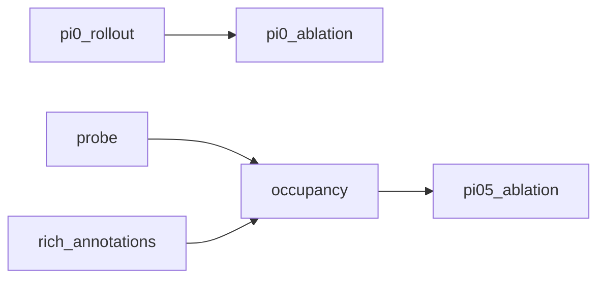

# VLA Interpretability

Code for reading and intervening on PI0 / PI0.5 hidden states on LIBERO. The repository is organized as six experiment blocks. Library code lives in `src/`; each block has its own CLI under `scripts/<block>/`.

```text
scripts/
  probe/              Demo 1 — PI0.5 layerwise linear probes on LIBERO states
  pi0_rollout/        Demo 2 — PI0 closed-loop tracing, probes, dashboard video
  pi0_ablation/       Demo 3 — PI0 layer × token-bin activation ablation
  rich_annotations/   Auditable LIBERO demo/frame labels
  occupancy/          PI0.5 3D self-occupancy decode, controls, CMI, NDS
  pi05_ablation/      Probe-guided offline action-chunk ablation and frame stats
```

Run artifacts belong in untracked `outputs/`. This repo does not ship HDF5, checkpoints, or experiment results.



## Setup

```bash
git clone https://github.com/bossxjh/vla_interpretability_handoff.git
cd vla_interpretability_handoff
conda env create -f environment.yml
conda activate vla-interpretability
```

If conda cannot resolve the LeRobot git dependency:

```bash
conda create -y -n vla-interpretability python=3.10
conda activate vla-interpretability
python -m pip install --upgrade pip
python -m pip install -r requirements.txt
python -m pip install "lerobot[pi,libero]@git+https://github.com/huggingface/lerobot.git"
```

Real PI0 / PI0.5 + LIBERO jobs need Linux, a GPU, and MuJoCo/EGL:

```bash
export MUJOCO_GL=egl
export PYTHONNOUSERSITE=1
export PI05_PATH=/path/to/pi05_libero
export PI0_PATH=/path/to/pi0_libero
```

Optional caches:

```bash
export HF_HOME=/path/to/huggingface_cache
export TORCH_HOME=/path/to/torch_cache
export LIBERO_ASSETS_PATH=/path/to/libero/assets
export HF_LEROBOT_HOME=/path/to/lerobot_dataset_cache
```

On a machine that already matches the original layout, `source start.sh` sets `MUJOCO_GL`, checkpoint paths, and related defaults. Cluster cache helpers are in `scripts/setup_cluster_env.sh` and can be ignored off-cluster.

Smoke-check the environment:

```bash
python - <<'PY'
import torch
print("torch", torch.__version__, "cuda", torch.cuda.is_available())
from lerobot.policies.pi0 import PI0Policy
from lerobot.policies.pi05 import PI05Policy
from lerobot.envs.configs import LiberoEnv
print("lerobot pi/libero imports OK")
PY
```

CPU-only unit tests (no GPU, no full LIBERO replay):

```bash
PYTHONNOUSERSITE=1 python -m unittest discover -s tests
```

## 1. Layerwise probing (`scripts/probe/`)

**Goal.** Test whether PI0.5 hidden states linearly encode visuomotor variables. The main figure is a multi-curve R² plot over `offset`, `target_position`, `gripper_position`, `action`, `action_chunk`, and ground-truth action labels when present.

Each LIBERO state stores RGB, instruction, gripper/target positions, and optional GT actions. PI0.5 is run once per state. Every transformer layer is mean-pooled over tokens, then a ridge probe is trained layer by layer.

```bash
python scripts/probe/collect_states.py \
  --config configs/demo.yaml \
  --env libero_dataset \
  --task libero_spatial \
  --task-id 1 \
  --num-samples 500

python scripts/probe/extract_activations.py \
  --config configs/demo.yaml \
  --model pi05 \
  --pi05-path "$PI05_PATH"

python scripts/probe/train_layerwise_probe.py --config configs/demo.yaml --target all
python scripts/probe/plot_results.py --config configs/demo.yaml --target all
```

Outputs: `outputs/activations/activations.npz`, `outputs/probes/layerwise_probe_*.csv`, `outputs/figures/layerwise_probe_targets_r2_comparison.png`.

Activation smoke test:

```bash
python scripts/probe/extract_activations.py \
  --config configs/demo.yaml --model pi05 --pi05-path "$PI05_PATH" --max-samples 10
```

## 2. PI0 closed-loop tracing (`scripts/pi0_rollout/`)

**Goal.** Record a PI0 LIBERO rollout (video, policy outputs, robot/object metadata, full-token activations), train rollout-time probes, and render a dashboard that aligns execution RGB, a layer×token activation heatmap, and a layer×probe-target error heatmap.

Default task: *pick up the black bowl from table center and place it on the plate*. By default the policy replans every environment step and writes all 36 layers of float16 tokens.

```bash
export ROLLOUT_DIR="$PWD/outputs/rollouts/pi0_libero_spatial_task1_full_tokens_30interval"

python scripts/pi0_rollout/collect.py \
  --config configs/demo.yaml \
  --pi0-path "$PI0_PATH" \
  --task libero_spatial \
  --task-id 1 \
  --instruction "pick up the black bowl from table center and place it on the plate" \
  --output-dir "$ROLLOUT_DIR" \
  --num-episodes 2 \
  --max-steps 250 \
  --replan-interval 30 \
  --save-video \
  --save-activations \
  --video-format mp4
```

Useful flags: `--force-replan-every-step --replan-interval 1`, or `--no-save-activations` to cut IO.

```bash
python scripts/pi0_rollout/analyze_dynamic_circuit.py \
  --config configs/demo.yaml \
  --rollout-dir "$ROLLOUT_DIR" \
  --pooling mean \
  --targets pickup_offset place_offset action policy_pred_action progress
```

Set `ANALYSIS_DIR` to the timestamped run printed by that command, then:

```bash
python scripts/pi0_rollout/render_dashboard.py \
  --analysis-dir "$ANALYSIS_DIR" \
  --rollout-dir "$ROLLOUT_DIR" \
  --episode-index 0 \
  --targets pickup_offset place_offset action policy_pred_action progress \
  --format mp4 \
  --tmp-dir /tmp
```

Inspect token layout with `scripts/pi0_rollout/inspect_token_layout.py`. MP4 encoding can fail on FUSE paths; `--tmp-dir /tmp` encodes locally first.

## 3. PI0 activation ablation (`scripts/pi0_ablation/`)

**Goal.** Zero one PI0 layer and one token bin during closed-loop rollouts and compare against a baseline. Default sweep: 36 layers × 96 bins with `bin_stride=4` (24 bins per layer, 864 conditions). Primary heatmap metric: `mean_policy_action_delta_l2`.

```bash
export ABLATION_DIR="$PWD/outputs/ablation/pi0_ablation_spatial_task1_full_sweep"

python scripts/pi0_ablation/sweep.py \
  --config configs/demo.yaml \
  --pi0-path "$PI0_PATH" \
  --output-dir "$ABLATION_DIR" \
  --task libero_spatial \
  --task-id 1 \
  --instruction "pick up the black bowl from table center and place it on the plate" \
  --num-episodes 2 \
  --max-steps 250 \
  --layers all \
  --token-bins 96 \
  --bin-stride 4 \
  --baseline-only \
  --no-save-video \
  --no-save-activations
```

Then shards (`--skip-baseline --baseline-dir "$ABLATION_DIR/baseline" --num-shards 8 --shard-index 0` … `7`), or a small smoke:

```bash
python scripts/pi0_ablation/sweep.py \
  --config configs/demo.yaml \
  --pi0-path "$PI0_PATH" \
  --output-dir "$ABLATION_DIR" \
  --baseline-dir "$ABLATION_DIR/baseline" \
  --skip-baseline \
  --layers 0,17,35 \
  --token-bins 96 \
  --bin-indices 0,24,48,72 \
  --num-episodes 1 --max-steps 80 \
  --no-save-video --no-save-activations
```

```bash
python scripts/pi0_ablation/merge_shards.py --input-dir "$ABLATION_DIR"
python scripts/pi0_ablation/plot_heatmaps.py \
  --input-dir "$ABLATION_DIR" \
  --metrics mean_policy_action_delta_l2 mean_gripper_position_delta_l2 success_gain \
  --annotate-top 20 --top-k 50
```

One unmerged shard: `python scripts/pi0_ablation/plot_single_shard.py "$ABLATION_DIR/shard_00_of_08"`.

`success_gain` is noisy with one or two episodes; treat action-delta heatmaps as the screening result.

### Optional PJLab rjob

Skip this unless jobs must go through `rjob`. Otherwise run `sweep.py` directly.

```bash
NUM_SHARDS=8 NUM_EPISODES=2 MAX_STEPS=250 BIN_STRIDE=4 \
PI0_PATH="$PI0_PATH" OUTPUT_DIR="$ABLATION_DIR" \
bash scripts/pi0_ablation/rjob_submit_pi0_ablation_sweep.sh
```

## 4. LIBERO rich annotations (`scripts/rich_annotations/`)

Balanced demo sampling plus quantile/event frames. Exports selected agent-view and wrist PNGs and JSONL with per-field `valid` / `provenance`. Distance is never labeled as contact. Action convention: `-1=open`, `+1=close`.

```bash
python scripts/rich_annotations/extract.py \
  /path/to/libero_spatial \
  --output-dir outputs/rich_annotations/libero_spatial_100 \
  --num-demos 100 \
  --frames-per-demo 16 \
  --seed 42 \
  --simulator auto
```

`--simulator off` skips replay; `required` fails instead of degrading.

```bash
python scripts/rich_annotations/inspect_frame.py \
  outputs/rich_annotations/libero_spatial_100 \
  --sample-index 0 \
  --output /tmp/libero-frame-report.md
```

Select by trajectory with `--episode-id "libero_spatial/<task>/demo_1" --frame 42`. Occupancy GT replay reuses the same `SimulatorReplay` helper.

## 5. Self-occupancy decode (`scripts/occupancy/`)

Replay LIBERO frames, voxelize Panda collision geometry in the Panda base frame, and train decoders from PI0.5 hidden cells to soft occupancy. The grid is `[-0.8, 0.8] × [-0.8, 0.8] × [0.0, 1.6]` metres. Without shuffle / proprioception / pixel controls, a high IoU is **not** evidence of an independent 3D self-model.

### Smoke demo (mean-pooled layers)

```bash
export PYTHONPATH="$PWD:/path/to/LIBERO"

python scripts/occupancy/run_demo.py \
  --hdf5 /path/to/libero_spatial/<task>_demo.hdf5 \
  --pi05-path "$PI05_PATH" \
  --output-dir outputs/self_occupancy/pi05_libero_spatial_smoke \
  --num-demos 6 --frames-per-demo 4 \
  --grid-size 16 --supersample 2
```

### Full LIBERO-Spatial run

Balances demos across the ten spatial HDF5s, stores resumable activation shards, uses equal-width token bins, and captures the static PaliGemma prefix plus Expert states at Euler times `t=1.0, 0.5, 0.1`. `--bins` is the partition; `--bin-indices` selects which bins are stored and trained.

```bash
python scripts/occupancy/run_full.py \
  --dataset-dir /path/to/libero_spatial \
  --pi05-path "$PI05_PATH" \
  --output-dir outputs/self_occupancy/pi05_libero_spatial_10k \
  --stage all \
  --max-tasks 10 --max-demos 500 --max-frames 20 --max-samples 10000 \
  --layers all --bins 96 --bin-indices all \
  --shard-size 8 --epochs 20 --batch-size 128 \
  --grid-size 16 --supersample 2
```

Resume with `--stage gt`, `--stage activations`, or `--stage train`. Older full-bin `activation_shards/` are incompatible with a new `--bin-indices` capture; delete that directory or use a new `--output-dir`.

```bash
python scripts/occupancy/plot_results.py \
  --run-dir outputs/self_occupancy/pi05_libero_spatial_10k \
  --plots 1,2,3,4
```

### Shuffle controls, CMI, NDS

These reuse a finished occupancy run (no recapture).

```bash
python scripts/occupancy/shuffle_controls.py \
  --run-dir outputs/self_occupancy/pi05_libero_spatial_10k \
  --bin-indices auto-1/4 \
  --controls global_timestep,within_demo \
  --epochs 20 --device auto
```

Capacity-constrained \(\widehat{I}_C(H;O\mid Q)=\mathrm{BCE}_Q-\mathrm{BCE}_{HQ}\). `observation_state` is EE+gripper only.

```bash
python scripts/occupancy/conditional_mi.py \
  --run-dir outputs/self_occupancy/pi05_libero_spatial_10k \
  --bin-indices stored --epochs 20 --device auto
```

`--decoder mlp` (default) is Linear→64→GELU→4096; `--decoder linear` is one Linear. Use a separate `--output-dir` when changing architecture.

Normalized H→Q vs H→O (`NDS_Q`, `NDS_O`, \(D_{O-Q}\)). Bottleneck 64 reuses occupancy `decoder.pt` for H→O.

```bash
python scripts/occupancy/nds_q_vs_o.py \
  --run-dir outputs/self_occupancy/pi05_libero_spatial_10k \
  --bottleneck 64 --epochs 20 --perm-control --device auto
```

## 6. PI0.5 probe-guided ablation (`scripts/pi05_ablation/`)

Offline (not closed-loop): sample occupancy frames, run a **fresh** `predict_action_chunk` for the baseline and for each selected bin, record flattened chunk L2. Policy cache is reset every forward; `select_action` is never used.

Layer-matched bin selection (not global top-k):

```bash
python scripts/pi05_ablation/select_bins.py \
  --metrics outputs/self_occupancy/pi05_libero_spatial_10k/metrics.csv \
  --output-dir outputs/ablation/pi05_probe_guided_layer_matched \
  --layers-per-tower 5 --bins-per-group 2 \
  --min-iou-gap 0.03 --max-good-bin-repeats 2 --expert-max-bin 48
```

```bash
python scripts/pi05_ablation/run_offline_ablation.py \
  --probe-run-dir outputs/self_occupancy/pi05_libero_spatial_10k \
  --selected-csv outputs/ablation/pi05_probe_guided_layer_matched/selected_conditions.csv \
  --pi05-path "$PI05_PATH" \
  --output-dir outputs/ablation/pi05_probe_guided_frames \
  --num-frames 1000 --sample-seed 0
```

`sampled_frames.csv` `row_index` aligns with `frame_deltas.npz` `chunk_l2[i]`. Replot with `--plot-only`.

Per-frame scalars (motion, kinematics, proximity, contact, phase; no self-occlusion) and impact-group histograms:

```bash
python scripts/pi05_ablation/extract_frame_stats.py \
  --sampled-csv outputs/ablation/pi05_probe_guided_frames/sampled_frames.csv \
  --output-dir outputs/ablation/pi05_probe_guided_frames/frame_stats \
  --simulator auto --replay-mode selected

python scripts/pi05_ablation/plot_frame_stat_groups.py \
  --stats-csv outputs/ablation/pi05_probe_guided_frames/frame_stats/frame_stats.csv \
  --impact-csv outputs/ablation/pi05_probe_guided_frames/frame_good_minus_bad.csv \
  --output-dir outputs/ablation/pi05_probe_guided_frames/frame_stat_groups
```

Impact is `mean(Δ_good) − mean(Δ_bad)`. Default groups: highest 20%, nearest-to-zero 20% of the remainder, lowest 20%. Histograms overlay those three groups per dimension, including LIBERO task.

Optional closed-loop IoU-diff plot (older `outputs/ablation/pi05_probe_guided` rollouts, not the offline frame job): `scripts/pi05_ablation/plot_closed_loop_iou_diff.py`. The PI0.5 closed-loop tracer used by intervention hooks is `src/online_rollout.py` / `src/online_rollout_cli.py`.

## Tests

| Module | File |
|---|---|
| Rich annotations | `tests/test_libero_rich_annotations.py` |
| Annotation report | `tests/test_libero_annotation_report.py` |
| Occupancy voxelize / split | `tests/test_libero_self_occupancy.py` |
| CMI / NDS | `tests/test_pi05_occupancy_cmi.py`, `tests/test_pi05_nds_q_vs_o.py` |
| Bin selection | `tests/test_pi05_probe_ablation.py` |
| Offline ablation | `tests/test_pi05_frame_ablation.py` |
| Frame stats / groups | `tests/test_pi05_frame_stats.py`, `tests/test_pi05_frame_stat_groups.py` |

LIBERO integration tests skip unless `RUN_LIBERO_INTEGRATION=1`. Full occupancy capture, PI0.5 forwards, and 1000-frame ablation need a GPU.

## Old script numbers

| Old | New |
|---|---|
| `scripts/01_collect_states.py` | `scripts/probe/collect_states.py` |
| `scripts/02_extract_activations.py` | `scripts/probe/extract_activations.py` |
| `scripts/03_train_layerwise_probe.py` | `scripts/probe/train_layerwise_probe.py` |
| `scripts/05_plot_results.py` | `scripts/probe/plot_results.py` |
| `scripts/09_collect_pi0_libero_rollouts.py` | `scripts/pi0_rollout/collect.py` |
| `scripts/13_analyze_pi0_dynamic_circuit.py` | `scripts/pi0_rollout/analyze_dynamic_circuit.py` |
| `scripts/14_render_pi0_dynamic_episode_video.py` | `scripts/pi0_rollout/render_dashboard.py` |
| `scripts/15_inspect_pi0_token_layout.py` | `scripts/pi0_rollout/inspect_token_layout.py` |
| `scripts/16_sweep_pi0_activation_ablation.py` | `scripts/pi0_ablation/sweep.py` |
| `scripts/17_merge_pi0_ablation_shards.py` | `scripts/pi0_ablation/merge_shards.py` |
| `scripts/18_plot_pi0_ablation_heatmaps.py` | `scripts/pi0_ablation/plot_heatmaps.py` |
| `scripts/19_plot_single_pi0_ablation_shard.py` | `scripts/pi0_ablation/plot_single_shard.py` |
| `scripts/20_extract_libero_rich_annotations.py` | `scripts/rich_annotations/extract.py` |
| `scripts/21_inspect_libero_rich_frame.py` | `scripts/rich_annotations/inspect_frame.py` |
| `scripts/22_run_pi05_self_occupancy_demo.py` | `scripts/occupancy/run_demo.py` |
| `scripts/23_run_pi05_self_occupancy_full.py` | `scripts/occupancy/run_full.py` |
| `scripts/24_plot_pi05_self_occupancy_results.py` | `scripts/occupancy/plot_results.py` |
| `scripts/25_run_pi05_occupancy_shuffle_controls.py` | `scripts/occupancy/shuffle_controls.py` |
| `scripts/27_run_pi05_occupancy_conditional_mi.py` | `scripts/occupancy/conditional_mi.py` |
| `scripts/28_run_pi05_nds_q_vs_o.py` | `scripts/occupancy/nds_q_vs_o.py` |
| `scripts/30_select_pi05_ablation_bins.py` | `scripts/pi05_ablation/select_bins.py` |
| `scripts/26_run_pi05_probe_guided_ablation.py` | `scripts/pi05_ablation/run_offline_ablation.py` |
| `scripts/31_extract_pi05_frame_stats.py` | `scripts/pi05_ablation/extract_frame_stats.py` |
| `scripts/32_plot_pi05_frame_stat_groups.py` | `scripts/pi05_ablation/plot_frame_stat_groups.py` |
| `scripts/29_plot_pi05_probe_frame_iou_diff.py` | `scripts/pi05_ablation/plot_closed_loop_iou_diff.py` |
| `scripts/rjob_*.sh` | `scripts/pi0_ablation/rjob_*.sh` |
